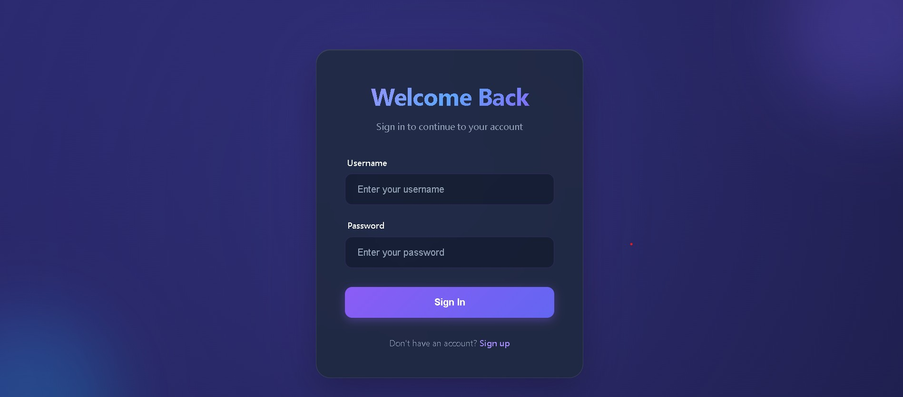

# 📝 Estatic Task Management App

A modern, full-stack task management web application built with React and Node.js. Features a beautiful glassmorphic UI with smooth animations and a complete CRUD functionality for managing your daily tasks.



## ✨ Features

- 🎨 **Modern UI/UX** - Beautiful glassmorphic design with gradient accents and smooth animations
- 🔐 **User Authentication** - Secure login page with attractive design
- ✅ **Task Management** - Create, read, update, and delete tasks
- 📝 **Task Details** - Add titles and descriptions to your tasks
- 🔄 **Status Tracking** - Mark tasks as completed or pending with prominent status buttons
- ✏️ **Edit Functionality** - Modify task titles and descriptions inline
- 🌈 **Responsive Design** - Works seamlessly across different screen sizes
- ⚡ **Real-time Updates** - Instant UI updates when managing tasks

## 🛠️ Tech Stack

### Frontend
- **React** (v19.2.0) - UI library
- **React Router DOM** (v7.9.6) - Client-side routing
- **Vite** (v7.2.4) - Build tool and dev server
- **CSS3** - Custom styling with glassmorphism effects

### Backend
- **Node.js** - Runtime environment
- **Express** (v5.1.0) - Web framework
- **CORS** - Cross-origin resource sharing
- **Body Parser** - Request body parsing

## 📁 Project Structure

```
Estatic_Task/
├── client/                 # Frontend React application
│   ├── src/
│   │   ├── components/    # Reusable components
│   │   │   └── TaskItem.jsx
│   │   ├── pages/         # Page components
│   │   │   ├── Login.jsx
│   │   │   └── Home.jsx
│   │   ├── App.jsx        # Main app component
│   │   ├── index.css      # Global styles
│   │   └── main.jsx       # Entry point
│   ├── package.json
│   └── vite.config.js
│
├── server/                # Backend Node.js application
│   ├── controllers/       # Business logic
│   │   └── taskController.js
│   ├── routes/           # API routes
│   │   └── tasks.js
│   ├── index.js          # Server entry point
│   └── package.json
│
└── README.md
```

## 🚀 Getting Started

### Prerequisites

- **Node.js** (v14 or higher)
- **npm** or **yarn**

### Installation

1. **Clone the repository**
   ```bash
   git clone <repository-url>
   cd Estatic_Task
   ```

2. **Install Backend Dependencies**
   ```bash
   cd server
   npm install
   ```

3. **Install Frontend Dependencies**
   ```bash
   cd ../client
   npm install
   ```

### Running the Application

You need to run both the backend and frontend servers:

1. **Start the Backend Server**
   ```bash
   cd server
   npm run dev
   ```
   The server will start on `http://localhost:5000`

2. **Start the Frontend Development Server** (in a new terminal)
   ```bash
   cd client
   npm run dev
   ```
   The app will be available at `http://localhost:5173` (or the port shown in terminal)

3. **Open your browser** and navigate to the frontend URL

## 📡 API Endpoints

### Tasks API (`/api/tasks`)

| Method | Endpoint | Description |
|--------|----------|-------------|
| GET | `/api/tasks` | Get all tasks |
| POST | `/api/tasks` | Create a new task |
| PUT | `/api/tasks/:id` | Update a task by ID |
| DELETE | `/api/tasks/:id` | Delete a task by ID |

### Request/Response Examples

**Create Task (POST)**
```json
{
  "title": "Complete project documentation",
  "description": "Write comprehensive README and API docs"
}
```

**Response**
```json
{
  "id": 1,
  "title": "Complete project documentation",
  "description": "Write comprehensive README and API docs",
  "completed": false
}
```

## 🎨 UI Features

### Login Page
- Elegant gradient background
- Glassmorphic login card
- Smooth hover animations
- Responsive design

### Task Dashboard
- **Header** - Gradient title with logout button
- **Add Task Form** - Dual input fields for title and description
- **Task List** - Glassmorphic cards with:
  - Task title and description
  - Edit functionality (inline editing)
  - Status toggle (Completed/Pending buttons)
  - Delete button with confirmation
  - Smooth animations on hover

## 🎯 Usage

1. **Login** - Enter your credentials on the login page
2. **Add Tasks** - Use the form at the top to create new tasks
3. **Edit Tasks** - Click the edit icon to modify task details
4. **Toggle Status** - Click "Completed" or "Pending" to update task status
5. **Delete Tasks** - Click the delete icon to remove tasks (with confirmation)
6. **Logout** - Click the logout button in the top-right corner

## 🔧 Development

### Available Scripts

**Frontend (client/)**
- `npm run dev` - Start development server
- `npm run build` - Build for production
- `npm run preview` - Preview production build
- `npm run lint` - Run ESLint

**Backend (server/)**
- `npm start` - Start production server
- `npm run dev` - Start development server with nodemon
- `npm test` - Run tests

## 🌟 Key Features Explained

### Glassmorphism Design
The app uses modern glassmorphism effects with:
- Semi-transparent backgrounds
- Backdrop blur effects
- Subtle borders and shadows
- Gradient accents

### State Management
- React hooks (useState, useEffect) for local state
- Async/await for API calls
- Error handling and loading states

### Responsive Layout
- Flexbox and Grid layouts
- Mobile-friendly design
- Adaptive spacing and sizing

## 🐛 Troubleshooting

### Common Issues

**Backend Connection Refused**
- Ensure the backend server is running on port 5000
- Check CORS configuration
- Verify API_URL in frontend matches backend port

**Tasks Not Loading**
- Check browser console for errors
- Verify backend is running and accessible
- Check network tab for failed requests

**Port Already in Use**
- Change the PORT in `server/index.js`
- Update API_URL in `client/src/pages/Home.jsx`

## 📝 License

This project is open source and available under the [ISC License](LICENSE).

## 👨‍💻 Author

**Ayush Patel**

## 🤝 Contributing

Contributions, issues, and feature requests are welcome!

## 📧 Support

For support, please open an issue in the repository.

---

**Made with ❤️ using React and Node.js**
